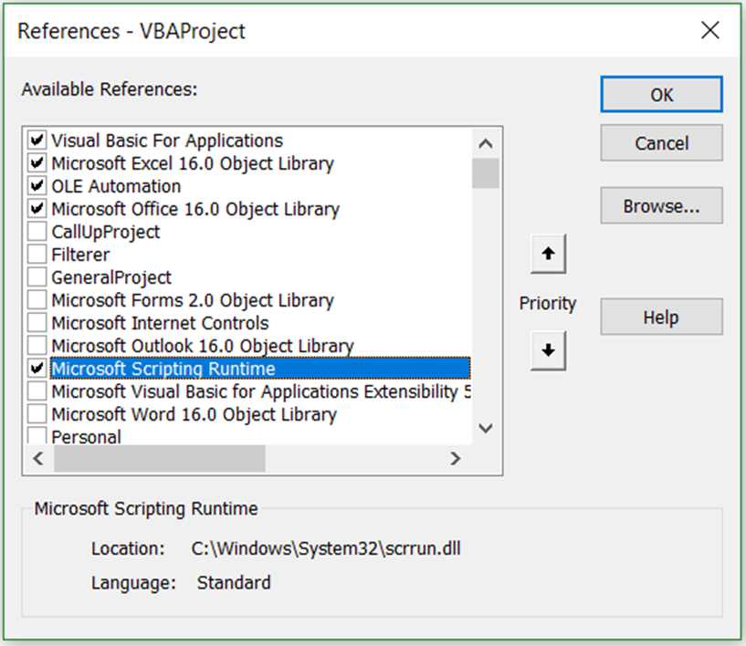

# References

If you've spent any time at all with Python, you'll know that almost every Python script you see starts off with a number of `import` statements.

This allows Python scripts to wrap up and separately contain potentially huge amounts of code in scripts, modules, and packages outside of the currently running document, and be referenced anywhere a given script is `import`ed.

VBA has similar functionality built into it, mainly via the "References" window. For context, here is how you would reference the Scripting Runtime Module from VBA:

First, on the menu bar at the top, you would click on Tools > References... :


Then you would find the correct module and check the box next to it:




From there you would be able to declare a variable as an object found within the referenced library like so:

```vb
Dim FSO As Scripting.FileSystemObject
Set FSO = New Scripting.FileSystemObject

' use FSO object here

Set FSO = Nothing
```

This GUI approach to referencing code outside the current module is made possible because the VBE is so perfectly woven into the fabric of VBA. This is known as "early binding" as the `Dim` statement declares exactly what will be used. There is also a coded way of achieving the same effect, using the `CreateObject` method. This is known as "late binding" because the `Dim` statement only shows that the variable will be a generic Object type, and it later attached to the correct library and class via `CreateObject`. This "late binding" method does not require you to reference the library through the Menu bar, it will not give you Intellisense tips for the methods and properties available to that object, and should you be deploying your code to other people's computers, it will nit be as strict about which version of the library is being used. It looks like this:

```vb
Dim FSO As Object
Set FSO = CreateObject("Scripting.FileSystemObject")

' use FSO object here

Set FSO = Nothing
```
Python (in general, unless we're speaking about closures) is a lot more straightforward. As long as you have the file on your computer and reference it correctly, you will be able to use all the code inside as allowed.

You can import your own code, or code that other people have written. 
For your own code, let's say you have 2 files named "A.py" and "B.py". Inside A.py you have written only `tf = False`. If you wanted to reference and print out that variable inside B.py you could write:
```python
import A
print(A.tf)
```
For code you didn't write, there are 2 main ways to go; use a module in the [Python Standard Library](https://docs.python.org/3/library/index.html) or download a module that someone else wrote. The Python Standard Library is what people refer to when they say Python comes with "Batteries Included" because there is a **wealth** of code to utilize in your projects, for free and pre-packaged in most Python distributions. You can reference these modules from any .py file you're writing as simply as this:

```python
import random

print(random.choice([1, 2, 3]))
```
Here we are referencing the builtin python library "random" and printing to the console the result of a function inside the random module called "choice". We pass the function "choice" a list containing the `ints` 1, 2 , and 3 and it will (randomly) select one from that list and return the result to the print function which displays the result.

Eventually you may find a need to go beyond the Python Standard Library, and that's when you're going to want to learn how to use the `pip` installer. Pip is the number one way to access literal TBs of code that other people are giving away for free on [PyPI](pypi.org). Once you have Python installed, you simply have to open a command prompt and type in `pip install` and the name of the package you're interested in downloading. For instance, if you wanted to download Pandas (once you have Python installed) you would open a command prompt and type in:

```cmd
pip install pandas
```

and it will automatically connect to PyPI and grab that package for you! Then at the top of your code/.py file you could reference it as simply as:

```python
import pandas
```
